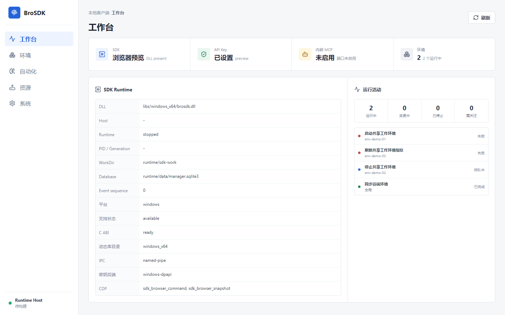
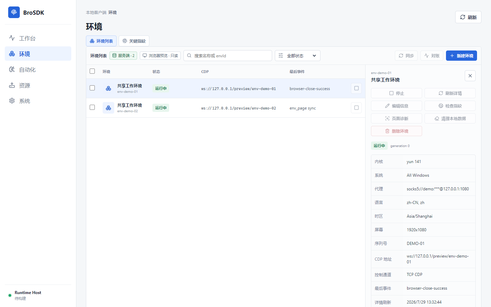
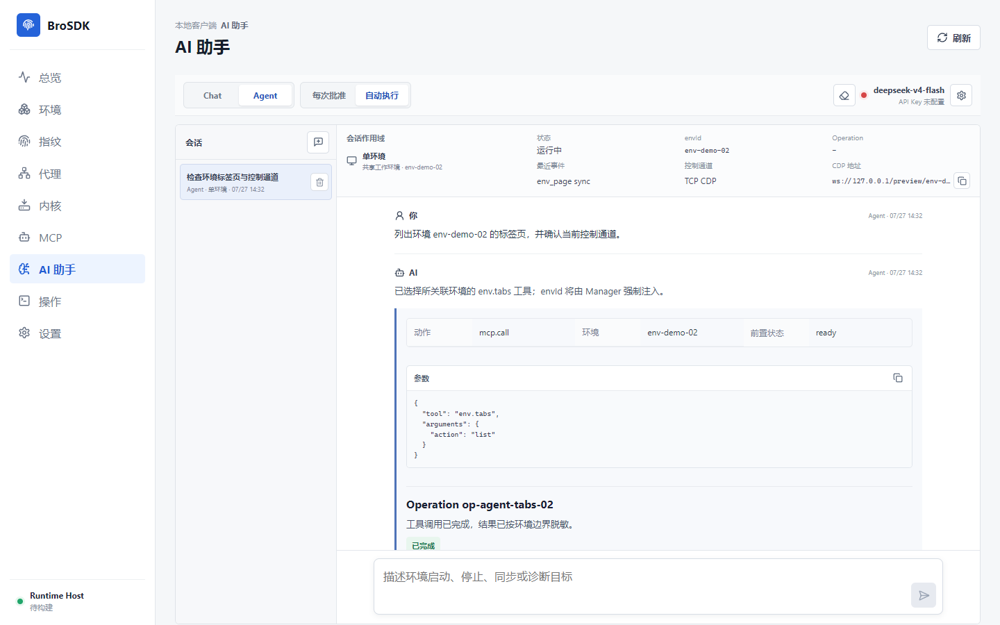

<p align="center">
  
</p>

# BroSDK Dashboard

<p align="center">
  <a href="README.md">Simplified Chinese</a> | <a href="README.en.md">English</a>
</p>

BroSDK Dashboard is a Windows desktop control center for BroSDK-based multi-profile fingerprint browsers. It manages environment lifecycle, proxies, browser kernels, remote fingerprint inspection, global MCP automation, and controlled AI Agent workflows.

The current 0.1.0 release is an internal preview for Windows x64. The repository includes the runtime files required for local development, including `libs/windows_x64/brosdk.dll` and the C API header `brosdk.h`. Local server API snapshots such as `doc.json` / `docs.json` are reference-only and are intentionally not committed. Current capabilities, known limitations, and release gates are tracked in [Current Status](docs/status.md).

The product goal before 1.0 is a reliable, understandable, and distributable multi-environment control center. Cross-border commerce is intentionally kept as a post-1.0 validation direction instead of becoming a full ERP module. See [Product Positioning](docs/product.md) and [Commerce Validation Roadmap](docs/commerce-roadmap.md).

## Core Capabilities

- First launch asks for an API Key and initializes through `getUserSig(role=user) -> sdk_init`. API Keys are protected with Windows DPAPI and are not written to SQLite, logs, or release manifests.
- Server data is the source of truth for environments, with `envId` as the unique primary key. Local SQLite only stores removable, redacted cache data with freshness metadata.
- Environment creation only requires a proxy and an installed kernel version; other fingerprint fields use server-side policy defaults.
- Kernel management merges the API Key `/api/v2/browser/kernelList` response, `sdk_init` `kernelVersions`, later `sdk_info` catalogs, and local installed cores. Server catalog requests include the current `platform/arch`, and the UI only shows installable kernels for the current machine.
- Environment create, sync, start, callback progress, stop, update, delete, detail refresh, and key fingerprint inspection are supported.
- An isolated `sdk-host.exe` process loads the DLL. Both Dashboard and Host are built as Windows GUI subsystem binaries, so no console window is shown in release builds.
- The desktop app is single-instance. Closing the main window keeps the app in the system tray, and launching again wakes the existing window.
- Information architecture is organized around five primary entries: Workspace, Environments, Automation, Resources, and System.
- The DLL global `/sdk/v1/mcp` endpoint is used through Manager. Environment page tools use `env.* + arguments.envId`; Manager injects the selected environment and applies tool allowlists.
- AI conversations are created as either global or single-environment sessions. The session scope is immutable after creation. Chat reads and Agent planning always call global `browser.status` before answering about runtime state, instead of trusting stale client cache. Conversation history is in-memory by default; it is only written to WebView local storage after the user explicitly enables "Save history".

## Screenshots

### Workspace



### Environment Workbench



### AI Agent



Screenshots are generated from read-only preview data. Run `npm run docs:screenshots` to refresh them at a 1440x900 viewport; the script also checks browser console errors and horizontal overflow.

## Architecture

```text
React Dashboard
      |
      | Tauri command / event
      v
Manager + SQLite cache + secure credentials
      |
      | named pipe, framed JSON
      v
sdk-host.exe
      |
      | BroSDK C ABI
      v
brosdk.dll ---- SDK server / browser runtime / global MCP
```

Dashboard never loads the DLL directly, talks to CDP directly, or calls `/api/v2/sdk/*`. Environment management comes from `/api/v2/browser/*` and matching DLL C APIs. Runtime status is reconciled from DLL callbacks and `sdk_browser_info`.

## Development

Requirements:

- Windows 10/11 x64
- Current Node.js LTS and npm
- Rust stable with `x86_64-pc-windows-msvc`
- Visual Studio Build Tools with MSVC and Windows SDK
- Microsoft Edge WebView2 Runtime
- A valid BroSDK API Key and SDK service connectivity

Install dependencies and run the real desktop development app:

```powershell
npm ci
npm run tauri:dev
```

On first launch, enter your API Key to initialize the SDK. `npm run dev` only starts the Dashboard frontend preview and does not provide DLL, tray, or native mutation capabilities.

If the SDK API URL is empty, release builds use the BroSDK reference-client default service `https://api.brosdk.com`. Override it in Settings only for private deployments, test environments, or internal Swagger services.

## Build And Packaging

Frontend production build:

```powershell
npm run build
```

Raw Tauri build entry:

```powershell
npm run tauri:build
```

Recommended Windows x64 release build:

```powershell
npm run release:windows
npm run release:verify
```

Portable package only:

```powershell
npm run release:portable
npm run release:verify:portable
```

Optional MSI package:

```powershell
npm run release:windows:msi
powershell -NoProfile -ExecutionPolicy Bypass -File scripts/verify-windows-release.ps1 -RequireMsi
npm run release:test:msi
```

### `target` vs `dist`

| Directory | Purpose | Shipped |
| --- | --- | --- |
| `target/` | Cargo/Tauri build cache, object files, raw executables, and raw bundles | No |
| `apps/dashboard/dist/` | Vite frontend output consumed by Tauri | No |
| `dist/release/` | Curated installers, portable directory, ZIP, and release manifest | Yes |

Default release layout:

```text
dist/release/
  BroSDK-Dashboard-<version>-windows-x64-setup.exe
  BroSDK-Dashboard-<version>-windows-x64-portable.zip
  WINDOWS-RELEASE-MANIFEST.json
  BroSDK-Dashboard-portable/
    BroSDK Dashboard.exe
    sdk-host.exe
    brosdk/brosdk.dll
    RELEASE-MANIFEST.json
```

See [Windows Release](docs/windows-release.md) for signing, installer, upgrade, and rollback notes.

## Testing

Static checks and unit tests:

```powershell
npm run security:tauri
npm run check
npm test
npm run e2e:dashboard
```

Desktop and runtime tests:

```powershell
npm run sdk:capabilities
npm run sdk:runtime-smoke
npm run e2e:dashboard:desktop
npm run e2e:tray
```

Real-account tests read credentials only from the current process environment or secure prompts. Do not commit API Keys, logs, screenshots, or reports containing secrets:

```powershell
$env:BROSDK_API_KEY = Read-Host "BroSDK API Key"
npm run e2e:environment
Remove-Item Env:BROSDK_API_KEY
```

Manager smoke validates local Host, Manager, server kernel catalog, and DLL MCP connectivity:

```powershell
$env:BROSDK_API_KEY = Read-Host "BroSDK API Key"
npm run manager:smoke
Remove-Item Env:BROSDK_API_KEY
```

Real AI Chat/Agent regression:

```powershell
$env:BROSDK_AI_API_KEY = Read-Host "AI API Key"
$env:BROSDK_E2E_ENV_ID = "<existing-env-id>"
npm run e2e:ai-assistant
npm run e2e:ai-assistant:desktop
Remove-Item Env:BROSDK_AI_API_KEY, Env:BROSDK_E2E_ENV_ID
```

Full testing and release handoff details are documented in [Testing And Release Handoff](docs/testing-handoff.md).

## MCP And AI Agent

The current DLL needs a single global MCP endpoint:

```text
http://127.0.0.1:<embedded-port>/sdk/v1/mcp
```

Manager dynamically discovers tools and `inputSchema` from runtime `tools/list`. All calls connect to the same DLL global endpoint, but the model tool catalog is generated from the immutable conversation scope:

- Global sessions expose global reads, explicit-env `browser.open/browser.close`, and DLL-advertised multi-environment browser tools.
- Single-environment sessions expose the same page tools while hiding `envId`; Manager overwrites `arguments.envId` with the bound environment.
- `env.list/resolve/get/create/update/destroy` are not mixed into page-tool allowlists.

Chat and Agent use OpenAI-compatible native `tools/tool_calls`. Chat is limited to reads from the current session catalog. Agent can use lifecycle and page tools through approved plans or a bounded automatic tool loop. AI never directly receives API Keys, userSig, full CDP URLs, or proxy credentials.

## Data And Security

- Default user data directory: `%LOCALAPPDATA%\BroSDK Dashboard`
- API Key and AI Provider Key: protected by Windows DPAPI
- Environment list and details: server is the source of truth; local cache is redacted and removable
- Runtime state: reconciled through a fresh Runtime Host on each client start
- AI conversation history: in-memory by default; "Save history" stores it in local WebView data until protected Manager storage is implemented or the explicit opt-in model is retained
- Desktop instance id: `com.brosdk.dashboard`
- Release signing: certificates are not stored in the repository; internal builds report `NotSigned` when unsigned

## Documentation

- [Documentation Index](docs/README.md)
- [Product Positioning](docs/product.md)
- [Current Status And Known Limitations](docs/status.md)
- [Release Roadmap](docs/roadmap.md)
- [Architecture And Process Boundaries](docs/architecture.md)
- [DLL C API Integration](docs/dll-integration.md)
- [Interface Coverage Matrix](docs/interface-coverage.md)
- [Manager Domain Model](docs/manager-domain.md)
- [Windows Release And Rollback](docs/windows-release.md)
- [Commerce Validation Roadmap](docs/commerce-roadmap.md)
- [Changelog](CHANGELOG.md)

## License

Project source code is released under the [MIT License](LICENSE).

The bundled `libs/windows_x64/brosdk.dll`, `brosdk.h`, and access to BroSDK services/APIs are not relicensed by this repository's MIT license. Their distribution, usage, and commercial terms remain governed by the applicable BroSDK license or service agreement.
