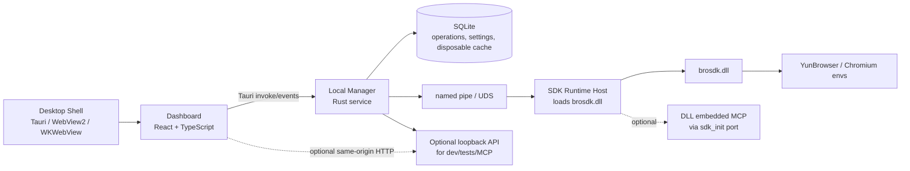

# BroSDK Dashboard 跨平台客户端架构

## 1. 目标

`brosdk-dashboard` 是新的本地桌面客户端项目。它吸收当前 `brosdk-v3` Windows WebView 客户端的产品形态和 Dashboard 功能，但把实现边界重新整理为更容易跨平台、测试和发布的结构。

首发平台是 Windows x64。运行时能力来自：

```text
libs/windows_x64/brosdk.dll
libs/windows_x64/brosdk.h
```

后续平台不改变 Dashboard、领域模型和管理 API，只补平台动态库、IPC、进程、密钥库和打包 adapter。

## 2. 技术选型

建议采用：

- 桌面外壳：Tauri 2 / Rust；Windows 使用 GUI subsystem，主窗口关闭后驻留系统托盘。
- Dashboard：React + TypeScript + Vite，移植 `brosdk-v3/apps/dashboard` 的信息架构和视觉基线。
- 本地 Manager：Rust async service，负责状态机、SQLite、operation 队列、设置、日志和事件。
- SDK runtime host：独立 Rust 后台子进程，加载 `brosdk.dll`，通过 named pipe/UDS 和 Manager 通讯；Windows 由 Manager 使用 `CREATE_NO_WINDOW` 启动，不显示独立终端。
- 本地持久化：SQLite WAL。
- 密钥保护：Windows DPAPI/Credential Manager；macOS Keychain；Linux Secret Service。

选择独立 runtime host 的原因是 `brosdk.dll` 的 v2 代码在某些路径上可能调用 `std::exit`，例如同 `appId` 实例锁冲突。让 DLL 运行在隔离进程中，可以避免 SDK 直接结束桌面窗口，并把崩溃、退出码、日志和恢复策略收敛到 Manager。

## 3. 进程拓扑



## 4. 责任边界

| 组件 | 负责 | 不负责 |
| --- | --- | --- |
| Desktop Shell | 窗口、托盘、菜单、单实例、更新、系统对话框 | 环境状态机、DLL 调用、数据库业务 |
| Dashboard | 展示、表单、筛选、批量操作、AI 助手界面 | 直接调用 DLL、直接访问 CDP、保存密钥 |
| Local Manager | 单写者、SQLite、operation、设置、事件、权限、诊断 | 浏览器进程细节、SDK 内部协议 |
| SDK Runtime Host | 加载 DLL、注册回调、执行 SDK C API、转发事件 | 持久化业务状态、UI 决策 |
| SDK Adapter | JSON 请求/响应、内存释放、错误码和事件归一化 | 产品状态推断、重试策略 |

## 5. 项目目录建议

```text
brosdk-dashboard/
  apps/
    desktop/                 Tauri app，窗口与托盘
    dashboard/               React Dashboard
  crates/
    manager/                 本地 Manager、operation 队列、SQLite
    sdk-host/                独立进程，加载 brosdk 动态库
    sdk-client/              Manager 侧 IPC client
    sdk-ffi/                 libloading 绑定和 C ABI 类型
    domain/                  领域模型、API schema、事件类型
    platform/                文件选择器、进程锁、密钥库、路径
    local-api/               可选 loopback API，用于开发/E2E/外部接入
  libs/
    windows_x64/
      brosdk.dll
      brosdk.h
  docs/
```

## 6. 数据模型

服务端是环境配置的唯一事实来源，本地只保留 operation、设置、profile 和可丢弃的远端缓存：

- `EnvironmentRecord`：SDK 服务端名称、远端 `envId` 与本机运行状态；不允许本地名称或标签覆盖。
- `RuntimeInstance`：易失态，包含 `envId`、generation、SDK reqId、PID/CDP/ready/exit fact。
- `ProxyProfile`：本地代理配置，密码进入系统密钥库。
- `FingerprintProfile`：先显示 SDK 返回的指纹摘要和预览；完整本地编辑器后续移植。
- `KernelRecord`：来自 SDK 内核清单和本地目录扫描的合并视图。
- `Operation`：所有启动、停止、创建、更新、删除、安装、诊断都必须进入 operation。
- `Settings`：数据目录、工作目录、扩展目录、SDK API URL、启动策略、日志级别。

阶段 3 已落地 SQLite WAL schema、持久化 operation 状态机和递增 Manager 事件。阶段 11 把 environment/environment_details 明确降级为可丢弃缓存：完整分页成功后原子替换，失败时保留旧值并标记 stale。具体 schema、事务边界与 generation 规则见 [manager-domain.md](manager-domain.md)。

环境详情采用按需读取而不是启动时全量拉取：Dashboard 选定环境后通过 Manager 的聚焦 operation 调用 DLL `sdk_env_getinfo`。Host 返回的服务端透明响应包含 Finger、Browser、Proxy，也包含 Cookie、Storage 和 DEK；Manager 只把前述可展示字段的脱敏摘要写入 `environment_details`。远端指纹查看器只读该摘要，不能把本地缓存写回服务端。

## 7. API 与事件形态

Dashboard 首选 Tauri command/event：

```text
manager.snapshot()
manager.listEnvironments(filter)
manager.createEnvironment(input)
manager.startEnvironment(envId, options)
manager.stopEnvironment(envId)
manager.listOperations(filter)
manager.updateSettings(input)
```

为测试、外部自动化和未来 MCP 保留可选 loopback API：

```text
GET  /api/v1/overview
GET  /api/v1/environments
POST /api/v1/environments/{id}/start
POST /api/v1/environments/{id}/stop
GET  /api/v1/operations
GET  /api/v1/events
```

mutation 都返回 operation，不等待浏览器完全 ready。事件必须有递增 sequence，便于 Dashboard 刷新后恢复。

阶段 10 将创建输入固定为最小产品契约：

```text
EnvironmentCreateInput {
  proxyProfileId?: string
  kernelId: string
}
```

Manager 根据 `kernelId` 生成服务端 `dto.FingerReqDto` 的顶层 `kernel` 和 `kernelVersion`，根据 `proxyProfileId` 从系统密钥库临时恢复完整代理 URL。`customerId`、`envName` 和 `finger` 均不发送：customer identity 来自 `getUserSig(role=user)` 建立的 userSig 上下文，服务端 `FingerReqDto.Valid()` 负责补齐默认指纹。Dashboard 不接触代理密码，也不允许透传任意创建 JSON。

DLL 的 `/sdk/v1/env/create` 与第三方服务端 `/api/v2/browser/create` 复用同一个 Go handler 和 `dto.FingerReqDto`，差异仅在认证中间件：DLL 初始化后使用 userSig，第三方接口直接使用 API Key。C ABI 的同步返回成功只代表 HTTP/FFI 调用完成；Manager 还必须校验响应业务字段 `code=200`，并要求 `data.envId` 存在。

`brosdk.dll` 本身已经包含内嵌 MCP / HTTP 能力。新客户端把它作为 `sdk-host` 的 platform capability 暴露：当 Manager 明确配置端口时，由 `sdk_init` 的 `port` 字段启用 DLL 内嵌端点；Dashboard 不直接依赖该端点，仍通过 Manager 统一处理 envId 路由、operation 状态、安全策略和未来审批。

Manager MCP adapter 只连接 DLL Streamable HTTP 全局端点 `/sdk/v1/mcp`。全局 session 的浏览器工具使用 `env.*` 名称，每次调用由 Manager 在 arguments 中强制写入已选择的 `envId`；`?envId=` 和 `/sdk/v1/mcp/env/{envId}` 只属于 DLL 向旧客户端保留的兼容面，本项目不再使用。adapter 严格执行 `initialize -> notifications/initialized -> tools/list -> tools/call -> DELETE`；仅发现工具时省略 `tools/call`。全局写工具仍由 Manager 对应 operation 代替；单环境目录从同一次全局 `tools/list` 中选取 `env.*` 浏览器工具，并显式排除 `env.create/update/destroy` 等环境管理工具。每次发现与调用都有 operation，页面 URL 降为 origin，响应经过 SDK 通用脱敏后才返回 Dashboard/Agent。设置端口只代表下次 init 的配置，只有本次 `sdk_init` 成功后 Manager 才把 adapter 标记为 active，host 停止或 degraded 会立即清空 active port。

## 8. 运行状态语义

环境状态分为：

```text
stopped -> preparing -> starting -> ready -> stopping -> stopped
              |            |          |
              +----------> failed <---+
```

状态来源合并规则：

- `sdk_browser_open` 返回 reqId 只表示 accepted。
- `browser-open-success` 表示 SDK 认为 CDP ready，是进入产品 ready 的必要条件。
- `sdk_browser_info` 用于重连、手动关闭浏览器后的对账。
- callback、`sdk_env_getinfo` 和 `sdk_browser_info` 都可补充外部 CDP endpoint；endpoint 缺失或端口为 0 时保持 ready，但标记为 DLL 内部控制通道。
- 手动关闭浏览器必须触发状态从 `ready` 变为 `stopped` 或 `failed`，不能长期停留在运行中。
- 启动期间看到窗口闪退时，不靠固定短超时判断；以 SDK 回调、进程退出事实和 `sdk_browser_info` 对账。

## 9. 内部通讯

内部 Manager 与 SDK Runtime Host 优先使用：

- Windows：named pipe。
- macOS/Linux：Unix Domain Socket。

消息格式采用长度前缀 JSON：

```json
{
  "id": "uuid",
  "type": "sdk.browser.open",
  "payload": {
    "envs": [
      { "envId": "..." }
    ]
  }
}
```

长度字段是 4 字节大端无符号整数，单帧上限 32 MiB。两侧都由专用 reader task 连续读取完整帧，再把已解析消息送入业务 channel；不能把“读取长度 + 读取 body”的 future 直接放进会被取消的 `select` 分支，否则半帧取消会让后续消息错位。

Manager 侧 `RuntimeHost` actor 同时监督子进程退出、请求响应、超时和事件广播。正常 `Shutdown` 进入 `stopped`；进程被 kill、崩溃、锁冲突退出或 IPC 异常进入 `degraded`。Manager 不做无限自动重启，桌面 UI 始终留在父进程中。

回调事件统一从 host 推送给 Manager：

```json
{
  "type": "sdk.event",
  "code": 0,
  "name": "browser-open-success",
  "payload": {},
  "receivedAt": "2026-07-25T00:00:00.000Z"
}
```

DLL callback 函数只在回调有效期内复制 `data/len` 到无界队列，不解析 JSON、不访问数据库。`sdk-host` 主任务随后完成 JSON 解析、敏感字段脱敏、递增 sequence、envId 提取，以及异步 SDK reqId 到 operation id 的映射。

`browser-open` 中间事件可携带 `data.percent/progress` 和 `statusName`。Manager 只把合法百分比和受限状态名压缩为运行摘要，Dashboard 在 starting 状态据此显示进度条；完整 callback payload 仍只留在脱敏事件诊断边界，终态继续以 `browser-open-success` 为准。

## 10. 安全边界

- API Key 只来自环境变量或系统密钥库，不写入文档、仓库、SQLite 明文字段或普通日志。
- AI API Key 同样只来自 `BROSDK_AI_API_KEY` 或平台安全存储；AI Base URL 与模型可以写入 Manager settings，密钥不会进入 settings、operation、事件、诊断包或模型上下文。
- userSig、代理密码、Cookie、CDK/DEK、Authorization、URL query 中的敏感值统一脱敏。
- Dashboard 不展示密钥、摘要或尾号，只显示凭据来源与初始化状态。
- 可选 loopback API 默认只监听 `127.0.0.1`，mutation 检查 Origin。
- 诊断包默认不包含密钥、Cookie 明文、代理密码和完整启动 URL。

## 11. 与当前 windows-webview 的继承关系

可直接继承：

- Dashboard 信息架构：总览、环境、指纹、代理、内核、操作、设置、AI 助手。
- 白色扁平视觉风格和最小窗口约束。
- 操作队列、事件驱动、ready 不等于 accepted 的产品语义。
- 全局 MCP 使用 `envId` 参数路由的思路。
- 目录选择、扩展选择、离线内核包导入等交互。

需要重写或隔离：

- 当前 C++ WebView2 launcher 替换为 Tauri shell。
- 当前 Node local-manager 替换为 Rust Manager，或短期保留 HTTP API 兼容层供迁移。
- 当前 N-API binding 替换为 `sdk-host` 独立进程加载 `brosdk.dll`。
- 当前 v3 本地运行时能力与 v2 DLL 能力不完全一致，先按 `libs/windows_x64/brosdk.h` 暴露的能力落地。

## 12. 跨平台策略

Windows x64 是首个完成平台。macOS/Linux 不在没有动态库和平台验证时承诺功能完成：

- 动态库目录按 `libs/<platform>_<arch>` 组织。
- `sdk-ffi` 通过平台 resolver 选择库名和加载路径。
- `sdk-host` 的 IPC、进程监督、日志路径和崩溃恢复按平台 adapter 实现。
- Dashboard 和 Manager domain 不包含 `cfg(windows)` 业务分支。
- 若某个平台 SDK 不支持某能力，Dashboard 显示 capability，而不是隐藏失败。

当前 adapter 状态：

- Windows x64：`brosdk.dll`、named pipe、DPAPI 已可运行。
- macOS：解析 `libs/macos_universal/libbrosdk.dylib`，使用 UDS 和 Keychain；缺库时 capability 为 unavailable。
- Linux x64：解析 `libs/linux_x64/libbrosdk.so`，使用 UDS 和 Secret Service；缺库时 capability 为 unavailable。
- `SdkCapabilities` 同时报告 `supportStatus`、`unsupportedReason`、`libraryDir`、`libraryFilename`、`secretBackend` 和 `ipcTransport`。

AI Agent 边界：

- Chat 除了读取 Manager 生成的脱敏快照，还会把 DLL 当次 `tools/list` 中允许的全局读取工具，以及所选 ready 环境的显式读取白名单，作为 OpenAI-compatible function tools 绑定给模型。Chat 不绑定 `env.navigate`、`env.act`、脚本、上传、下载等 mutation，也没有本地文件工具。
- Agent 把 Manager 生命周期/诊断动作和所选 ready 环境当次广告的 MCP 工具作为 function tools 绑定给模型。模型必须选择一个函数；Manager 将函数调用转换为现有 `AiAgentPlan`，再补写真实 `envId`、`expectedState` 和 UUID `idempotencyKey`，不会直接信任模型参数。
- MCP `inputSchema` 从 DLL `tools/list` 原样进入模型工具定义；环境 schema 中的 `envId/env_id` 会移除，调用时始终由 Manager 强制注入。Chat 每轮最多执行 4 个只读工具并只允许一轮工具回填，结果限制为 64 KiB 且继续脱敏。
- AI 会话历史保存在 WebView 本地存储，与服务端环境缓存分离；请求只发送有界 user/assistant 历史。Dashboard 不主动注入 API Key、userSig 和 SDK 原始响应，但用户手动输入的文本会保存在未加密会话中。
- Chat/Agent 的关联环境只包含用户选中或文本明确指定的精确 `envId`。外部 CDP endpoint 只发送 origin；pipe-only 环境只发送 `sdk-browser-command` 控制通道类型。完整 CDP 地址仅在本地 Dashboard 显示。
- Agent 模型通过原生函数调用提出结构化动作；Manager 同时解析文本中的已知 envId，并根据最新镜像写入 `expectedState` 和 UUID `idempotencyKey`，再校验 action 白名单。会话默认逐次批准，用户可显式选择自动执行；两种方式都通过同一个 Manager reservation 与二次状态校验。
- Agent 写操作统一复用现有 operation 队列，返回 operation id 和 accepted/ready 的状态语义。
- `mcp.call` 使用计划 envId 选择全局读取或 `env.*` 浏览器工具；单环境必须 ready，Manager 注入 envId，并在执行时再次用 DLL `tools/list` 验证工具存在。旧 `mcp.read` 继续提供严格的 7 工具读取兼容策略。
- DLL 内嵌 MCP 仍是 `sdk-host` capability，由 Manager 配置生命周期和路由，不把 DLL 端口暴露为 Dashboard 的直接写入口。
